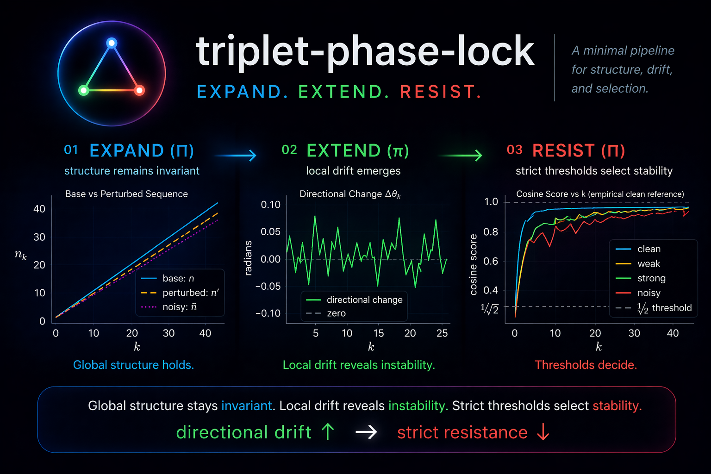

# triplet-phase-lock



A minimal pipeline for **structure → drift → selection**.

---

## 🚀 Run in Colab

Click any notebook to open and run instantly:

- [](https://colab.research.google.com/github/thinkthoughts/triplet-phase-lock/blob/main/notebooks/01_what_expands.ipynb)
- [](https://colab.research.google.com/github/thinkthoughts/triplet-phase-lock/blob/main/notebooks/02_what_extends.ipynb)
- [](https://colab.research.google.com/github/thinkthoughts/triplet-phase-lock/blob/main/notebooks/03_what_resists.ipynb)
- [](https://colab.research.google.com/github/thinkthoughts/triplet-phase-lock/blob/main/notebooks/04_cross_stage.ipynb)

Each notebook will:
- clone the repo into `/content/triplet-phase-lock`
- import from `src/`
- run without local setup

---

## Core idea

Triplet Phase Lock studies a simple system:

- **Expand (Π)** → global structure remains invariant  
- **Extend (π)** → local drift emerges  
- **Resist (Π)** → strict thresholds select stable trajectories  

Key relationship:

> directional drift ↑ ⇒ strict resistance ↓

---

## Notebooks

- `01_what_expands.ipynb`  
  → base sequence and triplet construction  

- `02_what_extends.ipynb`  
  → local differences and directional drift  

- `03_what_resists.ipynb`  
  → cosine thresholds and acceptance  

- `04_cross_stage.ipynb`  
  → full pipeline + drift vs resistance  

---

## Structure

src/
├── expand.py  
├── extend.py  
├── resist.py  
└── metrics.py  

notebooks/
├── 01_what_expands.ipynb  
├── 02_what_extends.ipynb  
├── 03_what_resists.ipynb  
├── 04_cross_stage.ipynb  
└── history/  

---

## Minimal usage

```python
from src.expand import sequence_n, build_triplets_from_values
from src.extend import direction_change
from src.resist import cosine_scores, empirical_clean_reference

k = range(1, 50)
values = sequence_n(k)
triplets = build_triplets_from_values(values)

drift = direction_change(triplets)

ref = empirical_clean_reference(triplets)
scores = cosine_scores(triplets, ref)
```

---

## Result

The system separates:

- invariant global structure  
- measurable local instability  
- threshold-based survival  

Minimal form:

```
structure → variation → selection
```

---

## Status

- notebooks: ✅ Colab-ready  
- src/: ✅ reusable  
- pipeline: ✅ expand / extend / resist  

---

## License

MIT
