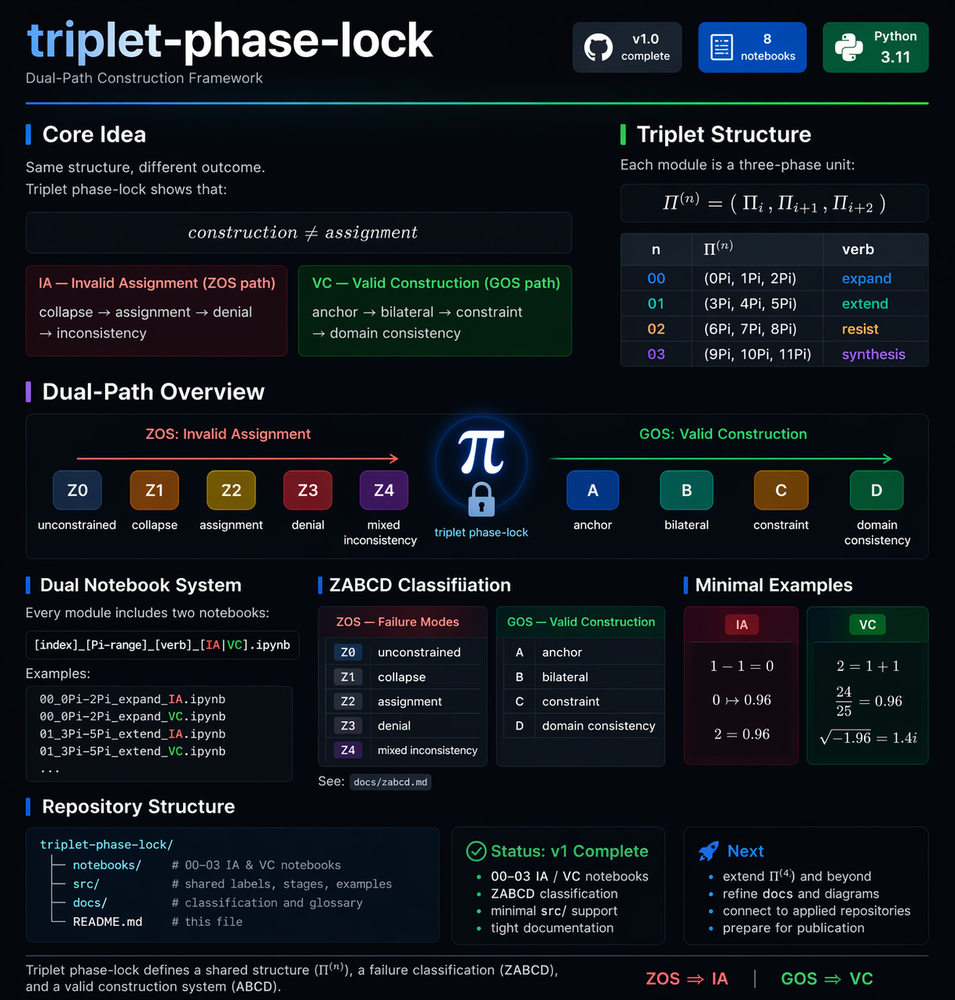
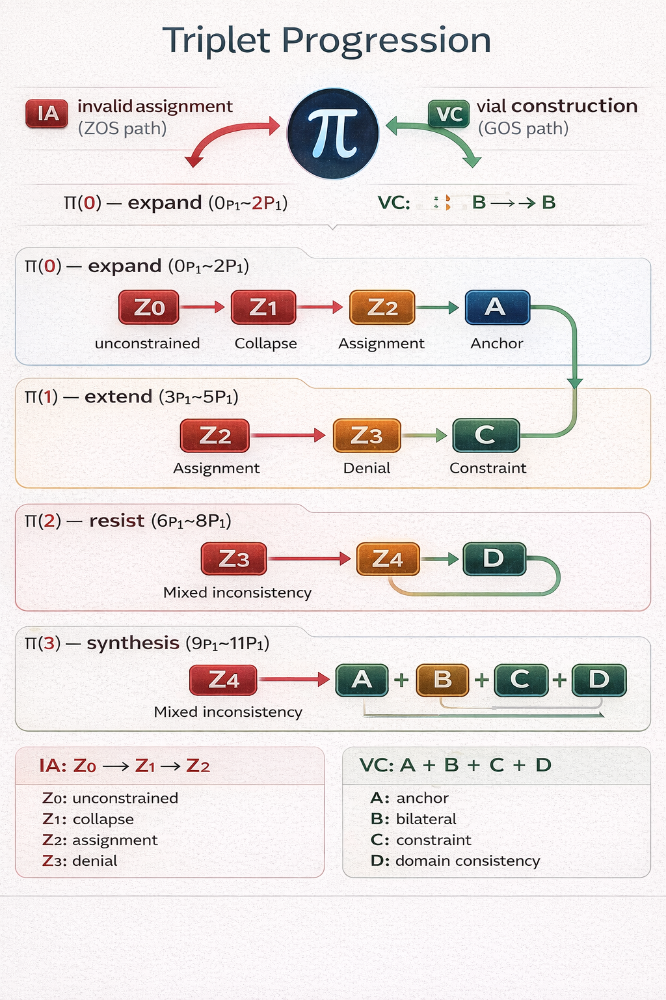

# triplet-phase-lock

Constraint-based modeling for consistent vs inconsistent outcomes.

[](https://github.com/thinkthoughts/triplet-phase-lock)

Dual-path construction framework.

**Definitions:** [Glossary](./docs/glossary.md)  
Docs: [docs/index.md](./docs/)  
📄 [Paper (PDF)](./docs/triplet_phase_lock.pdf)

---

## 🧭 Triplet Progression



---

## ⚡ Quick Start (2 min)

1. Open a notebook (IA or VC below)
2. Run all cells (Colab)
3. Compare outcomes:

- IA → inconsistent results  
- VC → consistent results  

Start here:

- [](https://colab.research.google.com/github/thinkthoughts/triplet-phase-lock/blob/main/notebooks/00_0Pi-2Pi_expand_IA.ipynb) Π⁽⁰⁾ IA  
- [](https://colab.research.google.com/github/thinkthoughts/triplet-phase-lock/blob/main/notebooks/00_0Pi-2Pi_expand_VC.ipynb) Π⁽⁰⁾ VC  

---

## 🛠️ How To Use

### 1. Compare IA vs VC
Run paired notebooks at the same stage:
- IA → shows inconsistency (assignment without constraint)
- VC → shows consistency (constraint-preserving construction)

### 2. Follow progression
Move through stages:
- Π⁽⁰⁾ → expand (initial behavior)
- Π⁽¹⁾ → extend (structure vs drift)
- Π⁽²⁾ → resist (stability vs breakdown)
- Π⁽³⁾ → synthesis (full system behavior)

### 3. Use as a diagnostic tool
Apply the framework to:
- equations  
- code  
- models  

Ask:
- Is this constructed (constraint-preserving)?
- Or assigned (unconstrained mapping)?

### 4. Use in your own systems
You can adapt this framework for:
- debugging mathematical reasoning  
- validating transformations in code  
- separating signal from noise in ML  
- enforcing consistency in agent workflows

### 🧩 Snippets

Reusable helpers for using `tpl` across repos:

- [`snippets/`](./snippets/)
---

## 🚀 Open in Colab

### Π⁽⁰⁾ — expand (0Pi–2Pi)
- [](https://colab.research.google.com/github/thinkthoughts/triplet-phase-lock/blob/main/notebooks/00_0Pi-2Pi_expand_IA.ipynb) IA
- [](https://colab.research.google.com/github/thinkthoughts/triplet-phase-lock/blob/main/notebooks/00_0Pi-2Pi_expand_VC.ipynb) VC

### Π⁽¹⁾ — extend (3Pi–5Pi)
- [](https://colab.research.google.com/github/thinkthoughts/triplet-phase-lock/blob/main/notebooks/01_3Pi-5Pi_extend_IA.ipynb) IA
- [](https://colab.research.google.com/github/thinkthoughts/triplet-phase-lock/blob/main/notebooks/01_3Pi-5Pi_extend_VC.ipynb) VC

### Π⁽²⁾ — resist (6Pi–8Pi)
- [](https://colab.research.google.com/github/thinkthoughts/triplet-phase-lock/blob/main/notebooks/02_6Pi-8Pi_resist_IA.ipynb) IA
- [](https://colab.research.google.com/github/thinkthoughts/triplet-phase-lock/blob/main/notebooks/02_6Pi-8Pi_resist_VC.ipynb) VC

### Π⁽³⁾ — synthesis (9Pi–11Pi)
- [](https://colab.research.google.com/github/thinkthoughts/triplet-phase-lock/blob/main/notebooks/03_9Pi-11Pi_synthesis_IA.ipynb) IA
- [](https://colab.research.google.com/github/thinkthoughts/triplet-phase-lock/blob/main/notebooks/03_9Pi-11Pi_synthesis_VC.ipynb) VC

---

## 🧠 Core Idea

Same structure, different outcome:

- **IA** — invalid assignment (ZOS path)  
  collapse → assignment → denial → inconsistency  

- **VC** — valid construction (GOS path)  
  anchor → bilateral → constraint → domain consistency

\[
\text{construction} \neq \text{assignment}
\]

This repository serves as the structural foundation for a broader set of constraint-based systems spanning geometry, quantum simulation, and autonomous agents.

---

## 🔁 Triplet Structure

\[
\Pi^{(n)} = (Pi_i, Pi_{i+1}, Pi_{i+2})
\]

- Π⁽⁰⁾ → expand  
- Π⁽¹⁾ → extend  
- Π⁽²⁾ → resist  
- Π⁽³⁾ → synthesis  

---

## 🧩 ZABCD vs ABCD

**ZOS (failure modes)**

- Z0 — unconstrained  
- Z1 — collapse  
- Z2 — assignment  
- Z3 — denial  
- Z4 — mixed inconsistency  

**GOS (valid construction)**

- A — anchor  
- B — bilateral  
- C — constraint  
- D — domain consistency  

See: `docs/zabcd.md`

---

## 🔬 Minimal Examples

**IA**
- \(1 - 1 = 0\)
- \(0 \mapsto 0.96\)
- \(2 = 0.96\)

**VC**
- \(2 = 1 + 1\)
- \(\frac{24}{25} = 0.96\)
- \(\sqrt{-1.96} = 1.4i\)

---

## ⚖️ Core Principles

- **construction ≠ assignment**  
- **constraint → signal > noise**  
- **GOS → structure**  
- **ZOS → inconsistency**  

Interpretation:
- IA (ZOS) → collapse, reassignment, mismatch  
- VC (GOS) → anchor, constraint, domain consistency

---

## 📁 Structure

```
triplet-phase-lock/
├── notebooks/
├── src/
├── docs/
│   ├── banner.png
│   ├── triplet_progression_light.png
│   ├── glossary.md
│   ├── zabcd.md
│   └── index.md
└── README.md
```

---

## 🔁 Reproducibility

All examples and constructions are reproducible via Python/Jupyter notebooks  
(Colab-compatible) provided in this repository.

---

## 🔗 Related Work

These repositories apply or extend the triplet phase-lock framework across different systems.

### Core Applications (connected)

- https://github.com/thinkthoughts/projection-constraint-lab  
- https://github.com/thinkthoughts/rydberg-parameter-lab  
- https://github.com/thinkthoughts/btz-phase-lock  

### Next Integrations (in progress)

- https://github.com/thinkthoughts/ion-benchmark-lab  
- https://github.com/thinkthoughts/ion-trap-parameter-lab  
- https://github.com/thinkthoughts/agent-constraint-gate  
- https://github.com/thinkthoughts/constraint-branch-collection  

---

### Interpretation

- Triplet Phase-Lock → structural core (IA vs VC)  
- Constraint Labs → filtering, stability  
- Quantum Systems → physical instantiations  
- Agent Systems → executable constraints  

**constraint → signal > noise**
